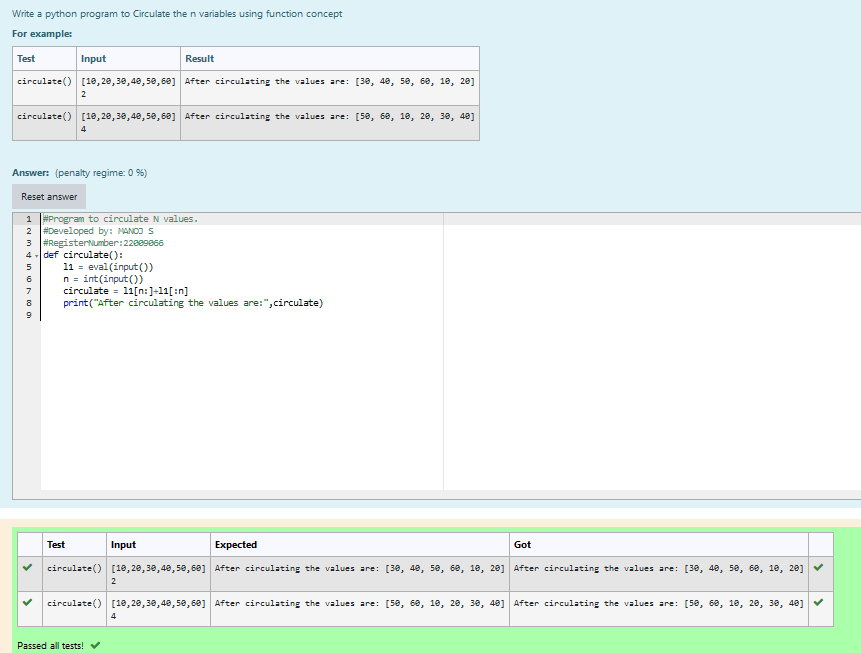

# Circulate-the-values-of-N-variables
## Aim:
To write a python program to circulate the n variables using function concept
## Equipment’s required:
PC
Anaconda - Python 3.7
## Algorithm: 
### Step 1: create a funtion for circulate the varibles.
### Step 2: Get the input from the user.
### Step 3: 
Get the value from the user for the number of rotation
### Step 4: 
Using the slicing concept rotate the list

### Step 5: Print the values after circulation.
### Step 6: End the program.
## Program:
```python
#Program to circulate N values.
#Developed by: MANOJ S
#RegisterNumber:22009066
def circulate():
    l1 = eval(input())
    n = int(input())
    circulate = l1[n:]+l1[:n]
    print("After circulating the values are:",circulate)
```

## Output:


## Result:
